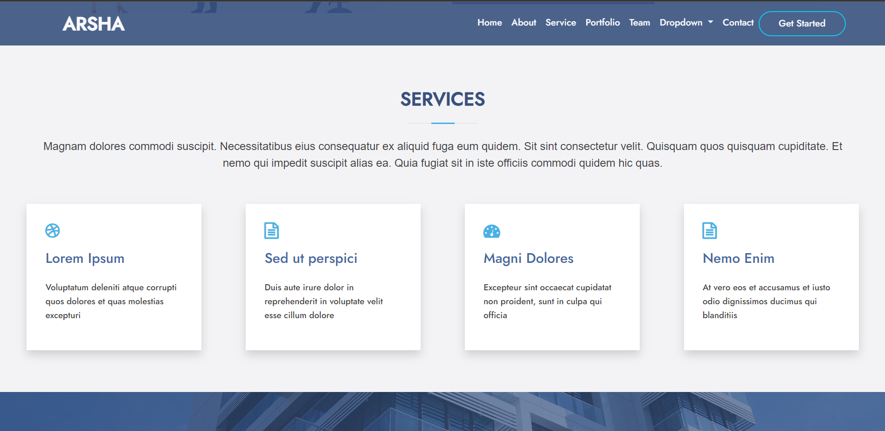
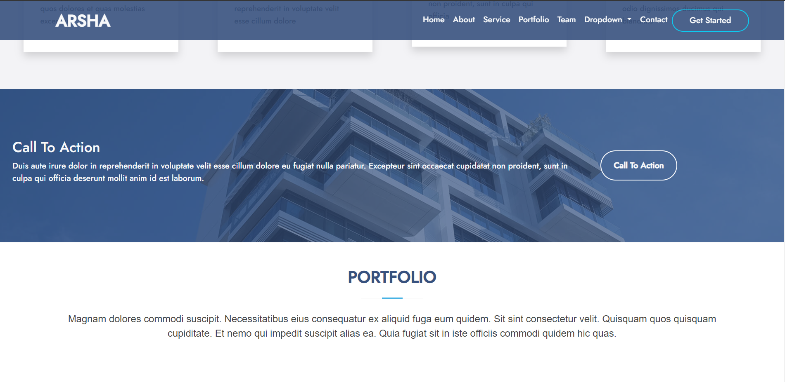
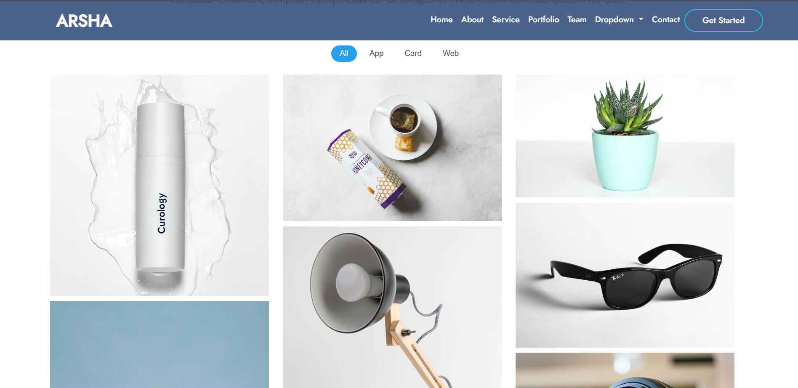

# Arsha Bootstrap Website

This is a business website created using HTML, Bootstrap, and CSS. The design inspiration comes from the Arsha Bootstrap website. The goal of this project is to learn and implement various features of Bootstrap, making the website responsive and accessible across different devices.

## Features

- Responsive design for a seamless viewing experience on different devices (tablet, mobile, laptop).
- Utilized Bootstrap components, including accordion, flex, grid, progress, and forms.
- Implemented various Bootstrap features to enhance the user interface and experience.

## Technologies Used

- HTML
- Bootstrap
- CSS

## Preview
### Laptop view

### Mobile view

## Contribution

If you'd like to contribute or report issues, please follow these steps:

1. Fork the repository
2. Create a new branch: `git checkout -b feature/new-feature`
3. Make your changes and commit them: `git commit -m 'Add new feature'`
4. Push to the branch: `git push origin feature/new-feature`
5. Open a pull request

## Acknowledgments

- Design inspiration: [Arsha Bootstrap](https://bootstrapmade.com/demo/Arsha/)

